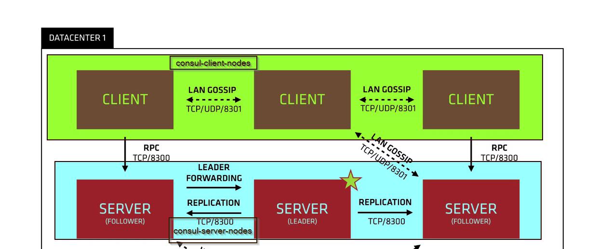

## Consul Cluster architecture




| | | |
_ _ _ 
| | | |


consul members

```
Node  Address             Status  Type    Build   Protocol  DC   Partition  Segment
c7-1  172.16.99.207:8301  alive   server  1.12.2  2         tpe  default    <all>
c7-2  172.16.99.208:8301  alive   server  1.12.2  2         tpe  default    <all>
c7-3  172.16.99.209:8301  alive   server  1.12.2  2         tpe  default    <all>
db4   172.16.99.204:8301  alive   client  1.12.2  2         tpe  default    <default>
db5   172.16.99.205:8301  alive   client  1.12.2  2         tpe  default    <default>
db6   172.16.99.206:8301  alive   client  1.12.2  2         tpe  default    <default>
```