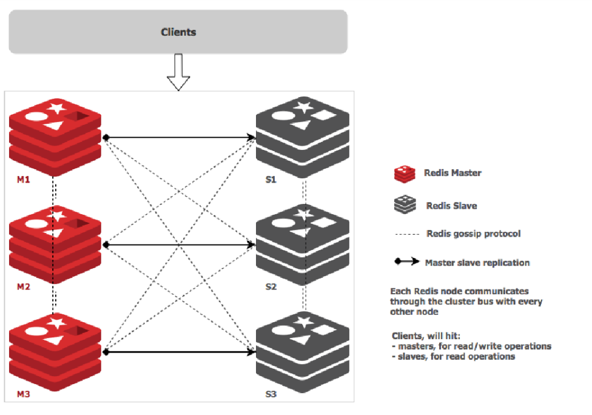

os base:
  - centos 7
  - Ubuntu 22.04

Redis version:
  - 6.2.7


## Redis cluster architecture

source: https://rancher.com/blog/2019/deploying-redis-cluster/


## redis cluster 

```bash
- hosts: redis-replication-nodes
  roles:
    - { role: Redis-Cluster, become: yes}

```


```

ansible/hosts

```
[redis-replication-nodes]
172.16.99.207 
172.16.99.208
172.16.99.209 
```


```
 in default/main.yaml
``` bash
## set redis port
redis_ports: 
  - 6379
  - 6380
  .
  .
  .
redis_cluster_enabled: "yes"
redis_cluster_node_timeout: 5000
redis_cluster_replica: 1
````


## start/stop redis service
```
systemctl start redis-6379
systemctl stop redis-6380

```


## start/stop redis service
```
systemctl start redis-6379
systemctl stop redis-6380

```


## show cluster node info
```bash
127.0.0.1:6379> cluster nodes
af3c53e4a2f0e0fa7003e89dd7acb8c6fb620a84 172.16.99.206:6380@16380 slave baf51a9e311ed8ae88c451391e78c61012c1b48c 0 1654696380000 2 connected
9f990651b6ae9cfedc88ad65c8e9511cced1b474 172.16.99.204:6380@16380 slave fc8a98813b3fe3d30a6a97a9b7a62bf967c8cca1 0 1654696379000 3 connected
bf4f4315e2b27d12c9de5a27b6126ccc5a0b3c68 172.16.99.205:6380@16380 slave 4ee4964d29fbf3d158132b0745b9e1916691e594 0 1654696379051 1 connected
4ee4964d29fbf3d158132b0745b9e1916691e594 172.16.99.204:6379@16379 myself,master - 0 1654696378000 1 connected 0-5460
baf51a9e311ed8ae88c451391e78c61012c1b48c 172.16.99.205:6379@16379 master - 0 1654696380000 2 connected 5461-10922
fc8a98813b3fe3d30a6a97a9b7a62bf967c8cca1 172.16.99.206:6379@16379 master - 0 1654696380757 3 connected 10923-16383

```