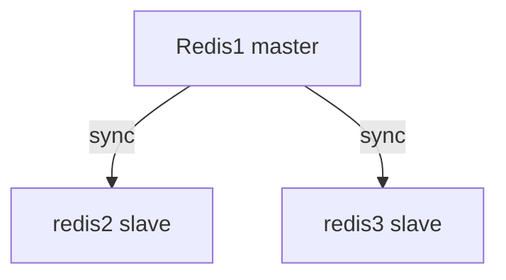
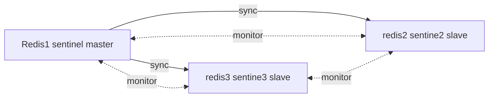

## redis single node

```bash

- hosts: node1
  roles:
    - { role: Redis , become: yes}

```


## Redis replication



```bash

- hosts: node1
  roles:
    - { role: Redis , become: yes, replication: true}

```

 in default/main.yaml
```bash
## Redis Replication
redis_replication_nodes_group: "redis-replication-nodes"
redis_replication_first_nodes: "{{groups[redis_replication_nodes_group][0]}}"
redis_masteruser: "masteruser"
redis_masterauth: "Theeb7oose" 
```

ansible/hosts

```
[redis-replication-nodes]
172.16.99.207 
172.16.99.208
172.16.99.209 
```


Redis replication + sentinel


```bash

- hosts: node1
  roles:
    - { role: Redis , become: yes, replication: true , sentinel: true }

```
 in default/main.yaml
``` bash
## Redis sentinel 
redis_sentinel_conf_path: "{{redis_app_path}}/redis/sentinel.conf"
redis_sentinel_port: 26379
redis_sentinel_pidfile: "/var/run/redis-sentinel.pid"
redis_sentinel_logfile: "{{redis_log_path}}/sentinel.log"
redis_sentinel_master_name: "ckmaster"
redis_down_after_milliseconds: 10000
redis_failover_timeout: 18000
````


